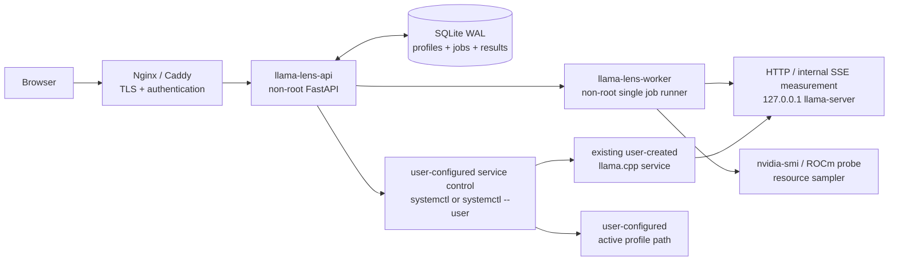
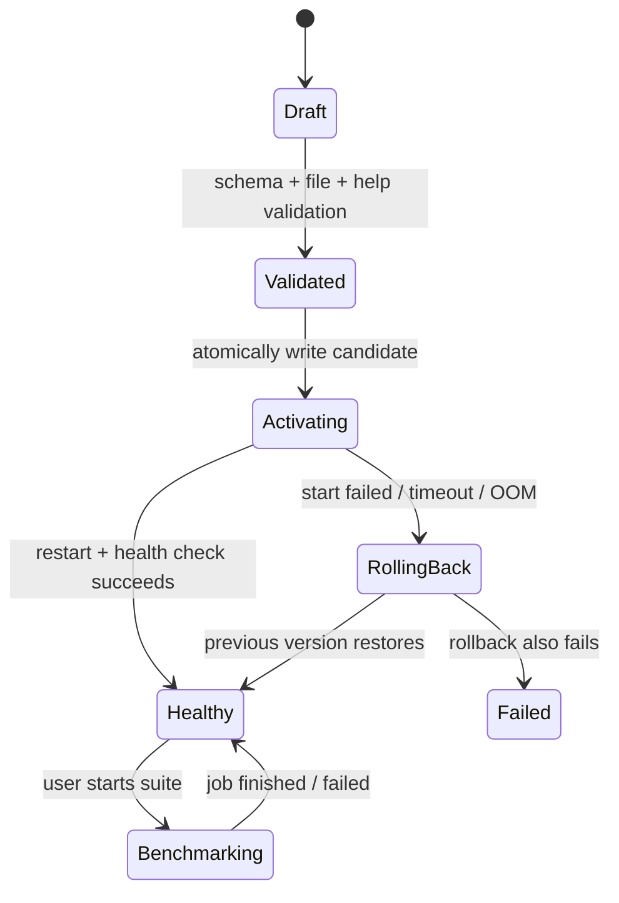

# LlamaLens 实施设计（V1：单机 llama.cpp 控制台）

## 1. 目标、边界与默认假设

LlamaLens 是部署在 **llama.cpp 推理服务器本机** 的 Web 控制台，用来：

1. 保存模型与 `llama-server` 参数组合（Profile）；
2. 安全地切换 Profile 并重启一个受控的 `llama-server` systemd 服务；
3. 用用户自定义 prompt 和请求参数测量 TTFT、Prefill tok/s、Decode tok/s、总耗时和资源峰值；
4. 查看日志、失败原因和历史对比结果。

V1 的有意边界：一台 Linux 主机、一个由用户预先创建的 `llama-server` systemd 服务、一个 SQLite 数据库、无集群调度、无任意 shell。LlamaLens V1 **不负责安装或创建任何 systemd service**；用户先创建 llama.cpp 服务和 LlamaLens 自身服务，再在 Web 设置页登记它们。以后扩展多主机时，把本机执行层替换为 SSH/Agent，不改变 Profile、Benchmark 和结果数据模型。

默认采用的技术栈：

| 层 | 选择 | 理由 |
|---|---|---|
| API | Python 3.11+、FastAPI、Pydantic、SQLAlchemy、Alembic | 参数校验、异步 HTTP、SQLite 迁移成熟。 |
| 前端 | Vue 3 + TypeScript + Vite + Vue Router + Pinia | 参数表单、实时任务状态、结果筛选和图表都适合单页界面；采用 Composition API，便于拆分复杂 Profile 表单与 benchmark 状态。 |
| 图表 | ECharts | 大表格、散点/柱状对比和缩放交互成熟。 |
| 持久化 | SQLite（WAL 模式） | 单机足够，备份只是复制一个文件；不会引入外部数据库。 |
| 后台执行 | 独立 `worker` 进程 + SQLite 作业表 | benchmark、健康检查、GPU 采样不可在 HTTP 请求内执行。 |
| 特权操作 | 用户自行配置的 `systemctl` 控制方式 | V1 不自动创建 sudoers/helper；推荐用户手动赋予 LlamaLens 运行用户仅控制目标 service 的权限。 |
| 反向代理 | Nginx 或 Caddy（可选） | 用于 TLS、认证和只对外暴露 Web；`llama-server` 默认仅监听 loopback。 |

## 2. 总体架构



职责必须分离：

- API：验证请求、读写业务数据、推送状态；按管理员登记的固定 service 名执行受控服务操作，**不拼接任意 shell 命令**。
- Worker：串行执行切换和 benchmark，向本机 `llama-server` 发送 HTTP 请求，采样资源。
- systemd 控制适配器：只允许操作设置中登记的固定 service 名；支持系统级 `systemctl` 和用户级 `systemctl --user` 两种模式。
- llama.cpp service：由用户自行创建并提供名称、unit 文件路径和参数配置方式；LlamaLens 不自动安装或替换它。

## 3. 目录与进程布局

```text
/opt/llama-lens/                         # 应用代码和前端静态文件，root-owned
/var/lib/llama-lens/llamalens.db          # SQLite，llama-lens 用户可写
/var/lib/llama-lens/jobs/                 # 非敏感任务临时文件/原始响应
/var/lib/llama-lens/logs/                 # 控制台自身日志（可选）
/var/lib/llama-lens/config.json            # Web 设置页保存的本机配置
/var/lib/llama-lens/profiles/<uuid>.json   # 规范化 Profile
/var/lib/llama-lens/active-profile.json    # 当前 Profile 指针/快照
# systemd unit 由用户自行创建，路径由设置页登记
```

首次打开 Web 时配置并保存以下信息：

```toml
llama_server_bin = "/srv/llama.cpp/build/bin/llama-server"
llama_service_name = "llama-server.service"
llama_service_file = "/etc/systemd/system/llama-server.service"
service_scope = "system"
service_control_command = "sudo -n systemctl"
active_profile_path = "/var/lib/llama-lens/active-profile.json"
model_roots = ["/srv/models"]
web_host = "127.0.0.1"
web_port = 3000
llama_host = "127.0.0.1"
llama_port = 8080
default_health_path = "/health"
```

设置页字段：

| 字段 | 用途 |
|---|---|
| llama.cpp systemctl 名称 | 例如 `llama-server.service`，后续 start/stop/restart/status 只能使用该固定名称。 |
| service 文件位置 | 例如 `/etc/systemd/system/llama-server.service`，用于读取、展示和检查配置；V1 默认不直接覆写。 |
| systemd 范围 | `system` 或 `user`；分别对应 `systemctl` 与 `systemctl --user`。 |
| 服务控制命令 | 系统级常用 `sudo -n systemctl`；用户必须自行配置权限。程序不保存 sudo 密码。 |
| llama-server 路径 | 用于读取 `--help`、`--version`、`--list-devices` 和参数目录。 |
| Profile/参数文件位置 | service 或 runner 实际读取的活动配置文件；用户自行保证 LlamaLens 可写、服务可读。 |
| 模型目录 | 用户可添加多个目录；用于扫描和限制本地模型路径。 |
| llama-server 地址与端口 | Benchmark 和健康检查访问的地址。 |
| LlamaLens Web 地址与端口 | 默认 `127.0.0.1`；用户可改为 `0.0.0.0`。无认证时对 `0.0.0.0` 显示高风险警告。 |

由于 V1 没有账户密码，默认必须监听 `127.0.0.1`。允许用户主动填写 `0.0.0.0`，但 UI 要明确提示：同一网络内任何能访问该端口的人都可能切换模型、重启服务、发起下载和运行 benchmark。V1 不阻止管理员这样配置，后续版本再增加登录、TLS 和角色权限。

`model_roots` 是安全边界：Profile 的 `model_path`、LoRA、mmproj、template、grammar、slot cache 等所有文件路径均必须解析为这些允许目录（或预先列出的只读目录）之下。禁止 `..` 穿越、符号链接逃逸和任意 URL 下载。

### 3.1 GPU 自动探测与多卡含义

用户不需要在安装设置里回答“NVIDIA、AMD 还是 CPU”。程序启动后自动探测：

1. 运行 `llama-server --list-devices`，这是实际 llama.cpp 构建可用设备的主要依据；
2. 检测到 `nvidia-smi` 时启用 NVIDIA 显存/利用率采样；
3. 检测到 ROCm 工具时启用 AMD 采样；
4. 都没有时按 CPU/未知后端运行，不显示假的 GPU 数据。

“多卡支持”仅表示一台机器如果有两张或更多 GPU，用户可从参数目录添加 `--device`、`--split-mode`、`--tensor-split`、`--main-gpu` 等 llama.cpp 原生参数。V1 不自动决定模型如何分卡；只有一张卡时这些高级参数可以完全忽略。

### 3.2 模型目录、搜索与下载

模型目录全部由用户在设置页添加。模型库提供两种搜索：

- 本地搜索：按文件名、路径、大小、GGUF 元数据、量化类型搜索已经扫描到的文件；
- 在线搜索：调用 Hugging Face 的公开模型/文件搜索接口，筛选 GGUF 文件。

下载任务由后台 worker 执行，用户必须选择一个已配置、可写的模型目录作为目标。界面显示文件名、来源 URL、预计大小、已下载字节、速度、失败原因，并支持取消和在服务端支持时断点续传。下载完成后重新扫描并计算文件 hash。V1 不自动删除模型；同名文件默认拒绝覆盖，交给用户选择新文件名或取消。

用户也可以直接填写下载 URL。URL 只用于 HTTP/HTTPS 文件下载，不会当作 shell 命令；保存路径必须位于用户配置的模型目录内。Hugging Face 私有仓库 token 作为可选的后续配置保存，不与 LlamaLens Web 登录混为一谈。

## 4. Profile 数据模型与参数规则

Profile 的首页不是一段自由文本命令，也不要求用户把所有性能参数都填完。它由“最小必填项、参数目录添加项、自定义参数尾部”三部分组成。这样普通用户只需要选择模型；需要调优时再搜索并添加参数；新版本尚未录入目录的参数仍能自行补充。

```json
{
  "id": "018f...",
  "name": "qwen3-32b-q4-8k-b2048",
  "model_path": "/srv/models/Qwen3-32B-Q4_K_M.gguf",
  "catalog_args": [
    { "flag": "--ctx-size", "value": "8192" },
    { "flag": "--gpu-layers", "value": "all" },
    { "flag": "--batch-size", "value": "2048" },
    { "flag": "--ubatch-size", "value": "512" },
    { "flag": "--flash-attn", "value": "auto" }
  ],
  "custom_args_text": "-np 1\n--cache-type-k q8_0\n--cache-type-v q8_0",
  "labels": { "model_family": "Qwen3", "quant": "Q4_K_M" }
}
```

### 4.1 Profile 编辑界面

#### 最小必填区

| 字段 | 是否必填 | 规则 |
|---|---|---|
| Profile 名称 | 是 | 默认从模型文件名自动生成，用户可修改，仅用于识别。 |
| 模型 | 是 | 从已扫描的模型库选择；实际生成 `--model <绝对路径>`。 |

服务监听地址、端口、二进制路径、模型允许目录是**安装级设置**，不出现在每个 Profile 表单中，避免用户切模型时误把管理 API 暴露到公网。其它 llama.cpp 参数均使用上游默认值，除非用户主动添加。

#### 参数目录区

参数目录是一个单独的可搜索表格。首次安装由当前服务器的 `llama-server --help` 生成并缓存；发布包内也带有按上游版本整理的种子目录。目录每行至少包含：短/长 flag、需要的值类型（开关、整数、浮点、枚举、路径、字符串）、说明、默认行为、风险级别和本机版本是否支持。

用户在搜索框输入 `parallel`、`batch`、`gpu` 等，点击“添加”后，参数进入下方的“已选参数”列表，并出现合适的输入控件。例如搜索 `parallel` 后添加并填 `1`，最终得到：

```text
--parallel 1
```

目录内的参数可排序、编辑、删除；重复参数显示冲突提示。对于可重复的 `--lora`、`--control-vector`、`--logit-bias` 等，允许添加多行。此区提供更好的字段提示，但不是强迫用户理解所有参数。

#### 自定义参数区

提供一个多行文本框，规则为“一行一个完整参数片段”。例如：

```text
-np 1
--cache-type-k q8_0
--cache-type-v q8_0
--tensor-split 3,1
```

每一行经过 POSIX `shlex` 风格分词，随后直接追加到 argv 数组；绝不执行 `bash -c`、`eval` 或字符串拼接出的 shell。也就是说，用户输入 `-np 1` 的效果就是最终命令末尾多出两个 argv 元素 `-np` 与 `1`。带空格的路径可用双引号，例如：`--chat-template-file "/srv/templates/my template.jinja"`。

这一区不要求参数必须已在目录中：它用于新版本参数、实验参数或尚未建模的复杂参数。保存时只做安全/语法检查（空行忽略、禁止 NUL、限制单行和总长度、必须能正确分词）；应用前会提示“本机 `--help` 未发现此 flag”，但管理员仍可以选择继续。若 llama.cpp 因未知/不兼容参数启动失败，标准健康检查和自动回滚照常生效。

### 4.2 最终 argv 的确定顺序

最终服务命令不是靠 shell 文本执行，而由 runner 按此固定顺序构建：

```text
[llama_server_bin]
  + [--model, model_path]                 # 最小必填区
  + installation_fixed_args               # 仅安装管理员可改，例如 host/port
  + catalog_args                           # 用户从目录添加的参数，按列表顺序
  + shlex_split(custom_args_text by line) # 用户自定义参数，始终追加在最后
```

因此，自定义区确实拥有“放在后面”的语义。若同一 flag 重复，多数 llama.cpp 标量参数会以后出现的值为准；但对累加型、多值或版本特殊参数不保证等价于覆盖。UI 对重复 flag 标黄，并展示最终 argv 预览，让用户明确看到真实顺序。

推荐用户在自己创建的 unit 中让 `ExecStart` 固定调用项目提供的 `llama-lens-runner`；runner 读取设置页登记的激活 Profile 文件，并以 `execve(argv)` 启动实际 `llama-server`。LlamaLens 不创建或修改这个 unit，只检查配置是否满足要求。这保留了“参数追加到启动命令结尾”的行为，同时没有 systemd 环境变量引用/引号拆分带来的歧义。

### 4.3 Profile 校验规则

保存草稿时校验 schema；应用前执行更严格的运行前校验：

1. 模型、adapter、template 等文件存在、为普通可读文件、真实路径在允许根目录内；
2. `catalog_args` 的已知参数按目录类型检查，例如整数、`on/off/auto`、设备名、路径；
3. 自定义文本可正确分词，单个 Profile/单行长度受限，且不含 NUL；
4. 已知路径类参数的真实路径必须在允许根目录内；自定义参数中的路径类 flag 如能识别也执行同样检查；
5. 将完整 argv 与当前 `llama-server --help` 清单比对：目录参数不支持时拒绝应用，自定义参数不支持时显著警告并允许管理员继续；
6. `--host 0.0.0.0`、`--agent`、`--tools`、MCP proxy、API key 等高风险项显示风险确认，并受安装管理员策略控制；
7. 不接受 shell 命令。最终以 runner 的 `execve(argv)` 调用，`custom_args_text` 永远不会被 shell 解释。

Profile 每次“应用”生成一个不可变 `profile_version`，保存完整 JSON、**最终展开 argv（含自定义尾部）**、模型 SHA-256、二进制版本、设备清单和创建时间。benchmark 引用 `profile_version_id`，因此历史结果不会被后续编辑污染。

## 5. 用户自建 systemd 服务的控制与回滚

### 5.1 权限前提

LlamaLens V1 不创建 service，也不修改 sudoers。用户必须自行完成以下二选一配置：

1. **系统级 service**：设置页选择 `system`，LlamaLens 使用 `sudo -n systemctl <action> <固定服务名>`；用户自行配置免密码权限，使 LlamaLens 运行用户只能控制这一项服务。
2. **用户级 service**：设置页选择 `user`，LlamaLens 使用 `systemctl --user`；用户自行开启所需的 linger/用户服务运行环境。

程序不保存 root 密码，也不支持交互式 sudo。若 `sudo -n` 返回权限不足，设置页展示检查失败和需要用户手动处理的命令说明。

### 5.2 service 控制适配器

配置保存后，适配器只生成以下固定形状的 argv：

```text
sudo -n systemctl status  llama-server.service
sudo -n systemctl start   llama-server.service
sudo -n systemctl stop    llama-server.service
sudo -n systemctl restart llama-server.service
journalctl -u llama-server.service -n 200 --no-pager
```

若选择 user scope，则将命令替换为 `systemctl --user ...` 和 `journalctl --user ...`。实际 service 名只能来自设置中已保存且验证通过的 `llama_service_name`，每次请求不能临时传入另一个名称。服务名只允许 systemd unit 合法字符，并强制以 `.service` 结尾。

适配器必须做到：

- 使用 `subprocess` argv 调用，无 `shell=True`；
- service 名、scope 和命令前缀只能读取已保存设置；
- Profile 文件通过临时文件 + `fsync` + `rename` 原子替换；
- 每次操作记录 service 名、动作、Profile 版本、退出码和 stderr；
- 设置页提供“测试 status 权限”和“测试 restart 权限”，但 restart 测试必须由用户明确点击。

用户手动配置 sudoers 时，应只允许目标 unit 的 `start/stop/restart/status`，不要给 LlamaLens 用户整个 `systemctl`、shell、编辑器或任意脚本权限。项目只提供配置文档和示例，不自动写入系统。

### 5.3 切换状态机



具体流程：worker 取得全局互斥锁 → 创建 switch job → 校验并原子写入 candidate Profile → 用已配置的控制适配器重启固定 service → 每 1 秒请求健康端点，最长等待可配置（默认 10 分钟）→ 成功时将 candidate 标记为 active；失败则写回 previous Profile 并再次重启。所有日志、systemd status、GPU OOM 线索都附在 job 记录中。

同一时间只允许一个“切换或 benchmark”作业运行。否则一边重启模型、一边压测会让结果和状态都不可解释。

## 6. Benchmark 设计

### 6.1 两类测量，V1 先完成服务基准

| 模式 | V1 状态 | 用途 |
|---|---|---|
| Service benchmark | 必做 | 请求正在运行的 `llama-server`，反映 API、slot、cache、参数组合的真实结果。 |
| Engine benchmark (`llama-bench`) | 第二阶段 | 更接近底层 pp/tg 核心，不包含 HTTP/chat template；不能替代服务基准。 |

TTFT、Prefill 和 Decode tok/s 是 V1 的三个核心指标。准确 TTFT 无法从普通非流式响应计算，因此 Benchmark worker 在后台对测试请求设置 `stream=true`，但前端**不展示逐 token 输出**，只展示任务进度和最终指标。用户所说的“不采用流式输出”落实为 UI 不做聊天式流式渲染，而不是放弃首 token 计时。

worker 使用单调时钟记录请求发出时间、首个实际内容 token 到达时间、最后 token 时间和结束时间；忽略 SSE 中只有角色、状态或空字符串的事件。最终事件如果包含 llama.cpp `timings`，直接读取 `prompt_n`、`prompt_ms`、`prompt_per_second`、`predicted_n`、`predicted_ms`、`predicted_per_second`。

若某个 llama.cpp 版本的流式结束事件不返回 `timings`，capability probe 会检测到这一点。为了仍然得到全部关键指标，worker 对该版本采用“配对测量”：先用内部流式请求测 TTFT，再用相同 Prompt 和请求参数发送一次非流式请求读取服务端 timings。结果明确标记 `measurement_mode=paired`，两个请求的数据不混成同一个原始响应。若 endpoint 连 timings 都不提供，则 Prefill/Decode 标记不可用，不能从总耗时猜测。

不同 llama.cpp 版本的 endpoint/字段可能变化。启动时运行 capability probe，记录健康端点、tokenize endpoint、completion endpoint、流式格式、请求字段映射、timings JSON path，以及单请求是否能同时取得三项指标。

### 6.2 测试配置与 Profile 完全解耦

Profile 决定服务如何启动；Benchmark 配置决定本次发什么请求。修改 prompt、`max_tokens` 或 timeout 不会改 Profile，也不会重启 service。同一个 Profile 可以运行任意数量、任意内容的测试配置。

测试表单字段：

| 字段 | 建议默认值 | 说明 |
|---|---:|---|
| 测试名称 | 自动生成 | 用户可保存为模板，例如“中文长文总结”。 |
| Prompt | 无，用户必填 | 多行文本框，原样发送；支持从已保存 Prompt 库选择。 |
| `max_tokens` | `256` | 最大输出 token 数；映射为当前 endpoint 支持的 `n_predict` 或 `max_tokens`。用户可改。 |
| Timeout | `300` 秒 | 单次 HTTP 请求超时；用户可改，超时单独计为失败。 |
| Temperature | `0` | 默认确定性更强；用户可改。 |
| Seed | `42` | 当前版本支持时发送，便于重复比较；用户可改或设为随机。 |
| Stop | 空 | 可选停止字符串列表。 |
| 缓存策略 | 冷缓存优先 | 默认请求 `cache_prompt=false`；用户可选择允许缓存。 |
| Warm-up 次数 | `1` | 预热结果不计入正式统计；可设为 `0`。 |
| 正式重复次数 | `3` | 每次保存独立原始结果，最终统计 median/min/max；用户可改。 |
| 并发数 | `1` | V1 默认单请求；用户可改为多并发测试吞吐。 |
| 额外请求参数 | `{}` | JSON 键值表，允许用户添加 endpoint 支持的特殊请求字段。 |

点击运行前展示最终请求 JSON。测试配置和每次实际请求 payload 都要保存快照，确保结果可追溯。

worker 在运行前调用同一服务的 tokenize endpoint，显示用户 Prompt 的实际 token 数；没有 tokenize endpoint 时再尝试同版本 `llama-tokenize`。输入 token 数由 Prompt 决定，不要求用户填写一个虚构的“目标长度”，最终以服务响应中的 `prompt_n` 为准。

为防止同一 Prompt 重复测试时 cache 污染 Prefill：默认发送 `cache_prompt=false`。若当前 endpoint 不支持关闭缓存，UI 明确提示“重复轮次可能命中 prompt cache”；用户也可以主动选择缓存命中测试。预热轮、正式轮和缓存策略必须分别记录。

系统可提供可编辑的快捷模板，但不强制采用固定场景。用户可以从空白测试开始，也可以载入“短对话、长 Prompt、并发吞吐”等模板后修改所有字段。

正式结果输出 median、p10、p90、min/max 和失败率，而不仅是一轮 tok/s。

### 6.3 资源采样与指标定义

worker 在每个请求运行期间以 500 ms 采样一次：NVIDIA 使用结构化 `nvidia-smi --query-gpu`；检测到 AMD 时可启用 ROCm probe；其他后端记录为“不可用”而不是报 0。存储原始采样的压缩摘要，以及 max/mean GPU memory、utilization、功耗、host RAM/CPU。

| 指标 | 定义 |
|---|---|
| TTFT | `first_content_token_received - request_started`；包含 HTTP、slot 排队、Prefill、首 token 生成和网络开销。 |
| Prefill tok/s | 服务端 `timings.prompt_per_second`；同时保存 `prompt_n`、`prompt_ms`。 |
| Decode tok/s（server） | 服务端 `timings.predicted_per_second`；同时保存 `predicted_n`、`predicted_ms`，作为主要 Decode 指标。 |
| Decode tok/s（client） | 当输出 token 数大于 1 时，用 `(output_tokens - 1) / (last_token_time - first_token_time)` 计算，作为客户端观测核对值。 |
| E2E latency | `request_finished - request_started`。 |
| Aggregate throughput | 并发场景所有成功输出 token / 所有请求墙钟跨度。 |
| Failure rate | `failed_attempts / attempts`；错误分类为 OOM、健康检查失败、HTTP、超时、解析失败。 |

## 7. 数据库设计

核心表：

| 表 | 关键字段 | 用途 |
|---|---|---|
| `models` | `id, real_path, sha256, size_bytes, gguf_metadata_json` | 扫描登记的只读模型。 |
| `profiles` | `id, name, labels_json, created_at, archived_at` | 用户可见的 Profile 身份。 |
| `profile_versions` | `id, profile_id, spec_json, argv_json, binary_version, model_sha256, device_snapshot_json` | 不可变、可复现的配置快照。 |
| `service_events` | `id, action, target_profile_version_id, prior_profile_version_id, state, diagnostics_json` | 切换、回滚、重启审计。 |
| `benchmark_suites` | `id, definition_json, version` | 场景定义。 |
| `benchmark_jobs` | `id, profile_version_id, suite_id, state, capability_snapshot_json, started_at` | 一个可恢复的任务。 |
| `benchmark_attempts` | `id, job_id, scenario, ordinal, request_json, raw_response_json, timings_json, error` | 每一次请求（含 warm-up）。 |
| `resource_summaries` | `attempt_id, gpu_json, host_json` | GPU/RAM/CPU 聚合峰值。 |
| `audit_log` | `actor, action, object_type, object_id, before_hash, after_hash` | 谁做了何种改变。 |

SQLite 使用 WAL、外键和短事务；较大的原始响应/日志写入文件并只存相对路径与 hash，防止数据库无限增长。默认保留原始 benchmark 响应 30 天、聚合结果永久；具体保留期为安装配置。

## 8. API 契约（V1）

API 采用 `/api/v1`，写操作使用 CSRF/认证保护。作业状态由 WebSocket 或 1 秒 polling 推送；V1 可先实现 polling，减少复杂度。

```text
GET    /api/v1/system/summary                 # 当前模型、service、资源、capabilities
GET    /api/v1/system/logs?lines=200
POST   /api/v1/system/restart
POST   /api/v1/system/rollback

GET    /api/v1/models                         # 只读模型库
POST   /api/v1/models/scan                    # 仅扫描允许目录

GET    /api/v1/profiles
POST   /api/v1/profiles                       # 创建草稿
GET    /api/v1/profiles/{id}
PATCH  /api/v1/profiles/{id}                  # 编辑草稿
POST   /api/v1/profiles/{id}/validate
POST   /api/v1/profiles/{id}/activate         # 返回 switch job

GET    /api/v1/suites
POST   /api/v1/suites
POST   /api/v1/benchmarks                     # {profile_version_id, suite_id}
GET    /api/v1/benchmarks/{id}
POST   /api/v1/benchmarks/{id}/cancel
GET    /api/v1/results?filters=...
GET    /api/v1/results/export.csv?filters=...
```

所有 `POST /activate`、`POST /benchmarks` 的返回值首先是 job，不假装同步成功。前端只能把状态展示为 `queued / validating / activating / warming_up / running / rolling_back / succeeded / failed / cancelled`。

## 9. 前端信息架构

前端按 Vue 单页应用实现：路由使用 Vue Router；跨页面状态（当前服务、任务、筛选条件）使用 Pinia；HTTP 使用一个统一的类型化 API client；可复用的 Profile 表单按“模型/性能/KV/多卡/API/高级参数”拆为 Composition API 组件。运行中任务先使用 1 秒 polling，后续可无破坏地替换为 WebSocket。

1. **概览**：当前 Profile、运行时间、模型、端口、GPU/RAM、最近一次基准和醒目的服务异常。
2. **模型库**：扫描结果、GGUF 元数据、文件大小/hash、可用性；不提供删除按钮。
3. **Profiles**：复制/编辑/校验/激活。基本页仅要求 Profile 名和模型；参数页提供可搜索目录、已选参数清单和“每行一个参数片段”的自定义尾部文本框，显示最终 argv、重复 flag、风险和版本兼容结果。
4. **Benchmark**：选择 Profile 版本和 suite，显示排队、重启、健康检查、warm-up、每轮结果、GPU 峰值及可取消按钮。
5. **结果**：Profile snapshot 与 Benchmark 配置快照分别不可变，按模型、参数、Prompt 模板、`max_tokens`、并发筛选；显示 TTFT、Prefill、服务端/客户端 Decode、总耗时、显存、失败率和原始证据链接。
6. **审计/设置**：服务路径、模型根目录、认证、数据保留期、事件记录；只给管理员。

防误操作：激活不同模型或会中断当前服务时，确认框展示“旧 Profile → 新 Profile、模型路径、显存预估未知/变化、会重启服务”。在 benchmark 运行中禁用激活按钮。

## 10. 实施阶段与验收条件

| 阶段 | 交付 | 验收 |
|---|---|---|
| 0. 环境探测 | 导入现有 unit 的只读信息、`--version`/`--help`/设备能力快照 | 不改任何现有 service；页面可展示实际启动命令。 |
| 1. service 接入 | 设置页、用户现有 unit 检查、Profile validate/activate/rollback | 不创建 unit；非法路径、NUL、不可分词的自定义行被拒绝；启动失败自动恢复上一 Profile。 |
| 2. Profile UI | 模型扫描、版本化 Profile、校验报告 | 复制、编辑、激活有 audit log；历史 Profile 不可变。 |
| 3. 核心基准 | 自定义 Prompt、可编辑请求参数、后台 SSE 首 token 计时、llama.cpp timings、预热和资源采样 | 同一测试重复运行可给 TTFT/Prefill/Decode 的 median/p90；请求与原始响应可追溯。 |
| 4. 并发与结果页 | suite、4/8 并发、筛选、CSV | 可横向比较两个 Profile，明确区分冷缓存与缓存命中。 |
| 5. 加固 | 登录/TLS、保留期、失败演练、备份恢复 | 无任意 shell/root 权限通路；SQLite 备份恢复已演练。 |

## 11. 实际部署时需要用户提供的信息

下列信息不需要现在写死在代码中，首次打开设置页时由用户填写并检测：

1. llama.cpp service 名称、service 文件位置、system/user scope，以及 LlamaLens 是否已有权限执行 status/restart。
2. `llama-server` 或自定义 wrapper 的绝对路径；程序自动读取 `--version`、`--help`、`--list-devices`。
3. 一个或多个模型目录、默认下载目录，以及是否配置 Hugging Face token。
4. LlamaLens Web 的 host/port；默认 `127.0.0.1`，用户可主动改成 `0.0.0.0` 并接受无登录风险提示。
5. service 是否按推荐方式让 `ExecStart` 调用 `llama-lens-runner` 读取活动 Profile；如果采用其它方式，需要登记参数文件如何被 service 读取。

## 12. 已知风险与处理

| 风险 | 处理 |
|---|---|
| llama.cpp 版本与本文参数清单不一致 | 首次/每次应用 Profile 都读取实际 `--help` 并做 capability snapshot；不兼容直接阻止。 |
| 模型 OOM 或启动卡住 | 启动超时、日志采集、自动回滚、OOM 分类；不覆盖上一可用 Profile。 |
| prompt cache 让 Prefill 失真 | 冷缓存与命中缓存分开 suite，写 nonce，保存 cache 设置。 |
| 改 chat template 后 token 数不同 | 结果保存实际 token 数与 template/hash。 |
| 控制台被用于提权 | 固定 service 名、用户自行配置的最小 systemctl 权限、路径边界、`execve(argv)`、无 shell；自定义参数只影响 llama-server 进程。 |
| 数据库或磁盘膨胀 | 原始数据保留策略、压缩、按 job 清理，不清理聚合指标。 |
| 并发作业互相干扰 | 单 worker 全局锁；系统状态和 benchmark job 均有显式状态机。 |
